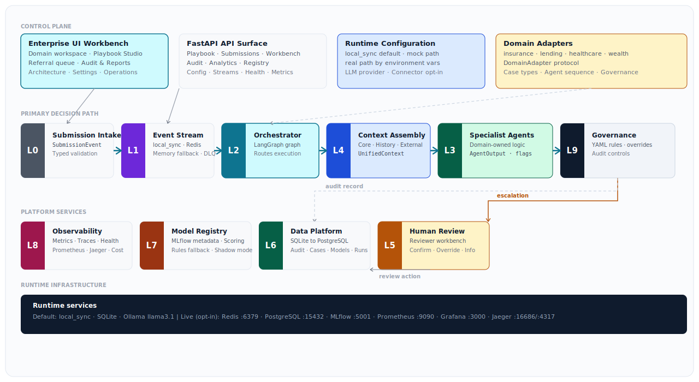

# Agentic Decisioning Fabric

**Domain-independent regulated decision platform**

Author: Sarala Biswal &nbsp;·&nbsp; Repository: `agentic-regulated-decisioning`

---


## What this is

A production-grade agentic decisioning platform with a constant L0–L9 architecture and pluggable domain behavior. The same runtime executes insurance underwriting, consumer lending, healthcare prior authorization, and wealth management suitability decisions — without domain logic in platform code.

Business users run typed Playbooks. The platform validates, assembles context, executes specialist agents, applies jurisdiction-aware governance, routes human review when required, and writes append-only audit records. Every decision is traceable, explainable, and reconstructible from persisted records alone.

**Keywords:** Agentic AI · Multi-agent systems · LLM orchestration · MLOps · LangGraph · MCP · FastAPI · Python · Enterprise AI · Regulated AI · Responsible AI · AI governance · AgentOps · Generative AI · RAG · LLMOps · AI platform engineering · Machine learning platform · AI/ML infrastructure · Pydantic · MLflow · Observability · Audit trail · Human-in-the-loop

---

## The problem

Regulated industries — insurance, lending, healthcare, wealth management — make high-impact decisions every day: underwriting submissions, credit applications, prior authorization requests, suitability assessments. These decisions carry legal weight, require documented rationale, and must be reproducible for regulators.

In practice, they are made across disconnected systems. Rules live in one place. Case data lives in another. Model outputs are generated separately. Reviewer notes are captured in a queue tool. Audit records — if they exist — are assembled after the fact from fragments across all of these.

The result is a set of recurring operational failures:

- **Decisions cannot be explained.** The factors that drove an outcome are scattered across systems. Producing a coherent rationale for a regulator or a declined applicant requires manual reconstruction.
- **Reviewers lack context.** A human reviewer receives a case reference, not assembled evidence. They spend the first portion of every review reconstructing what the system already knew before they can act.
- **Jurisdiction rules are hardcoded.** When a state changes a prohibited rating factor or a federal regulation updates an adverse action disclosure requirement, the change touches multiple codebases across multiple teams.
- **Audit trails are incomplete or mutable.** Records are updated in place. Model versions are not tracked alongside decisions. Human overrides are not linked to the automated decision they replaced.
- **Every regulated domain rebuilds the same foundation.** The insurance team builds intake, routing, governance, and audit. The lending team builds the same things with different names. Each rebuild carries the same failure modes.

The consequence is slow review cycles, inconsistent explanations, weak traceability, and compounding cost every time a new regulated workflow needs to be added.

## How this architecture addresses it

The structural answer is to separate the platform from the domain. The platform handles intake, event streaming, orchestration, context assembly, governance, human review routing, data persistence, model management, and observability. The domain plugs in its specific agents, rules, and configuration without modifying platform code.

| Operating failure | Architecture response |
|---|---|
| Decisions cannot be explained | Every agent returns a typed `AgentOutput` with a required `explanation` field, `confidence` score, `evidence` references, and `flags`. The field is non-optional by schema — an agent that cannot explain its decision returns `confidence: 0.0` and triggers human review. |
| Reviewers reconstruct context manually | The workbench receives a `WorkbenchCase` assembled before the reviewer opens it: submission, unified context, all agent outputs in sequence, recommendation, escalation reason, and governance result. Nothing needs to be reconstructed. |
| Jurisdiction rules are hardcoded | Governance rules are YAML files per domain and jurisdiction. The shared rules engine loads the correct file at runtime. Adding a new jurisdiction is a new YAML file — no platform code changes. |
| Audit trails are incomplete or mutable | Audit records are append-only. Automated decisions, human overrides, human confirmations, and model lifecycle events each write a new record. No record is ever updated or deleted. |
| Model versions are not tracked with decisions | The model registry records which version produced each score. Promotion, rollback, and shadow-mode comparison events are audited alongside decisioning records. |
| Business and technical views diverge | The UI has three persona modes: Business (outcomes and plain-language rationale), Technical (schemas, layer timings, traces, costs), and Side-by-side. Same data, different lens. |
| Every domain rebuilds the same platform | Domain adapters plug into one L0–L9 runtime path through a typed `DomainAdapter` protocol. No platform module imports domain-specific code. Adding a domain is an adapter implementation, not a platform change. |
| Real services block local development | `APP_MODE=local_sync` runs the full decision path with SQLite and Ollama — no external service dependencies. Live services activate through environment configuration. |

---

## Technology stack

### Core platform

| Category | Technology | Role |
|---|---|---|
| Language | Python 3.12 | Primary backend language |
| API framework | FastAPI | All API surfaces — REST and SSE streaming |
| Data validation | Pydantic v2 | Typed schemas at every layer boundary |
| Agent orchestration | LangGraph | StateGraph with typed `OrchestratorState` — conditional routing, node-level execution |
| LLM inference | LiteLLM + Ollama | Multi-provider abstraction — mock, local, and hosted paths |
| Context protocol | Python MCP SDK | Model Context Protocol — abstract vendor system interfaces |
| Async runtime | Python asyncio | Parallel MCP source assembly via `asyncio.gather` |
| Packaging | pyproject.toml + uv | Dependency management and build |

### Data and persistence

| Category | Technology | Role |
|---|---|---|
| Local store | SQLite | Default local runtime — audit, workbench, DLQ, costs, models, Playbook runs |
| Live store | PostgreSQL + asyncpg | Live service path — same schema, async connections |
| Migrations | Custom migration runner | `make migrate` applies schema against configured backend |
| Model registry | MLflow | Model metadata, artifact storage, stage promotion, shadow mode |
| Event stream | Redis Streams | Live submission stream, DLQ, pending inspection |

### AI and machine learning

| Category | Technology | Role |
|---|---|---|
| LLM providers | Ollama · OpenAI · Anthropic · LiteLLM | Rationale generation — deterministic fallback when unavailable |
| Local models | llama3.1 (default) | Default Ollama model for agent explanation generation |
| ML training | scikit-learn · gradient boosting · MLflow pyfunc | Regulated tabular scoring — risk, credit, criteria, suitability |
| Optional runtimes | XGBoost · LightGBM · ONNX · PyTorch · TensorFlow | Advanced local scoring via MLflow model families |
| Model governance | MLflow stage promotion | Staging → Production with shadow comparison and rollback |
| Deterministic fallback | Rules-based scoring | Always available when no promoted MLflow model exists |

### Observability and operations

| Category | Technology | Role |
|---|---|---|
| Metrics | Prometheus | Counter, histogram, and gauge metrics across all platform layers |
| Dashboards | Grafana | Operational dashboards — submission volume, escalation rate, cost, latency |
| Tracing | OpenTelemetry + Jaeger | Distributed trace spans — MCP calls, agent execution, governance, audit |
| LLM cost tracking | Custom cost tracker | Token cost per agent run, per domain — persisted to data store |
| Health checks | FastAPI health endpoint | Database, Redis, and MLflow availability at `/health` |
| Log structure | structlog | Structured JSON logging with trace correlation |

### Frontend

| Category | Technology | Role |
|---|---|---|
| Framework | React 18 + Vite | Enterprise workbench UI |
| Language | TypeScript | Typed API client and component contracts |
| Charts | Recharts | Analytics, confidence distributions, cost trends, approval rates |
| Streaming | EventSource (SSE) | Real-time layer execution events in Playbook Studio |
| Styling | Tailwind CSS | Utility-first enterprise design system |

### Developer experience

| Category | Technology | Role |
|---|---|---|
| Linting | ruff | Python lint and format |
| Type checking | mypy | Static type enforcement |
| Testing | pytest + pytest-asyncio + pytest-cov | 80% coverage gate — all tests run on mock path |
| CI | GitHub Actions | lint → typecheck → test on every push and PR |
| Containers | Docker + docker-compose | Local open-source service stack |
| Kafka topology | docker-compose.kafka.yml | Production-style event stream topology (optional) |

---

## Quick start

```bash
make install    # install Python and Node dependencies
make migrate    # prepare local SQLite store
make demo DOMAIN=insurance CASE=commercial_property JURISDICTION=US_CA
make dev        # start API
cd ui && npm run dev   # start React workbench
```

---

## Demo commands

```bash
make demo DOMAIN=insurance  CASE=commercial_property JURISDICTION=US_CA
make demo DOMAIN=lending    CASE=auto_loan           JURISDICTION=US_TX
make demo DOMAIN=healthcare CASE=prior_auth_imaging  JURISDICTION=US_NY
make demo DOMAIN=wealth     CASE=suitability_check   JURISDICTION=US_FL
python demo.py --all
```

The CLI prints agent decisions, layer evidence, routing path, governance posture, confidence, and elapsed time for each run.

---

## Architecture — L0–L9

```
L0  Submission intake       FastAPI + Pydantic — normalize all channels to SubmissionEvent
L1  Event stream            local_sync default · Redis Streams live path · DLQ on failure
L2  Domain orchestrator     LangGraph StateGraph — context, agents, governance, audit
L3  Specialist agents       Domain-owned — return typed AgentOutput with required explanation
L4  Context assembly        asyncio.gather across core, history, external MCP sources
L5  Human review            Reviewer workbench — confirm, override, request information
L6  Data platform           SQLite local · PostgreSQL live — audit, cases, models, runs
L7  Model registry          MLflow metadata and scoring · deterministic fallback always available
L8  Observability           Prometheus · Grafana · Jaeger · LLM cost tracking
L9  Governance              YAML rules engine · jurisdiction-aware · append-only audit
```

## Architecture diagram



> Full reference document: [regulated_decisioning_architecture.html](docs/regulated_decisioning_architecture.html)

---

## Domain plugin architecture

All domain-specific logic lives under `domains/`. The platform queries each adapter through a `DomainAdapter` protocol — no platform module imports from a domain-specific module.

```
domains/
├── base.py                    DomainAdapter protocol + shared types
├── registry.py                DomainRegistry.get(domain_id) → DomainAdapter
├── insurance/                 Fully implemented · three agents · jurisdiction governance
├── lending/                   Working adapter · federal governance rules
├── healthcare/                Working adapter · privacy framework governance
└── wealth/                    Working adapter · suitability governance
```

**Architectural claim:** domain is a plugin. The platform is constant.

Proof:

```bash
pytest tests/test_domain_protocol.py -v
```

This test asserts that all four adapters satisfy the `DomainAdapter` protocol and that no platform module contains domain-specific imports.

| Domain | Agent sequence | Escalation defaults | Governance source |
|---|---|---|---|
| insurance | triage → risk_scoring → appetite_check | confidence 0.75 · value $1M · mandatory: surplus_lines | `domains/insurance/governance/` |
| lending | eligibility → credit_scoring → policy_check | confidence 0.76 · value $750K · mandatory: mortgage | `domains/lending/governance/federal.yaml` |
| healthcare | clinical_triage → criteria_check → coverage_rules | confidence 0.80 · value $100K · mandatory: complex_case | `domains/healthcare/governance/` |
| wealth | suitability → risk_tolerance → product_eligibility | confidence 0.78 · value $1M · mandatory: options_authorization | `domains/wealth/governance/` |

---

## Playbook flow

A Playbook is a business-readable YAML file defining domain, case type, jurisdiction, rule overrides, and a test submission. Business users work with Playbooks. Technical routing, agent sequencing, model configuration, and connector implementation are owned entirely by the platform.

```yaml
playbook:
  name: "Commercial Property — San Francisco"

domain:
  name: insurance
  case_type: commercial_property

jurisdiction:
  code: US_CA

rules:
  max_auto_decision_value: 1000000
  prohibited_factors:
    - credit_score

submission:
  property_address: "450 Market Street, San Francisco, CA 94105"
  construction_type: masonry
  year_built: 1991
  total_insured_value: 4200000
  occupancy: office
  prior_claims: 1
```

Starter templates are in `static/playbook_templates/`. Download a template, fill in the `submission:` section, upload it to Playbook Studio, and run.

**Playbook API:**

```
POST /api/v1/playbook/validate
POST /api/v1/playbook/run
GET  /api/v1/playbook/{id}/stream
GET  /api/v1/playbook/{id}/results
GET  /api/v1/playbook/{id}/audit-record
GET  /api/v1/playbook/{id}/report
GET  /api/v1/playbook/templates
GET  /api/v1/playbook/templates/{name}
GET  /api/v1/playbook/history
```

---

## Runtime modes

| Mode | Stream | Data | LLM | Use |
|---|---|---|---|---|
| `local_sync` (default) | Direct execution, memory inspection | SQLite | Ollama · deterministic fallback | Local development and demos |
| `mock` | In-process memory stream | SQLite | Mock · deterministic fallback | CI and isolated tests |
| `real` | Redis Streams when configured | PostgreSQL when configured | Ollama or hosted provider | Live service smoke and integration |

Default environment:

```
APP_MODE=local_sync
DATABASE_URL=sqlite:///.local/regulated_decisioning.db
LLM_PROVIDER=ollama
OLLAMA_MODEL=llama3.1
```

---

## Live service path

```bash
make docker-up      # start Redis, PostgreSQL, MLflow, Prometheus, Grafana, Jaeger, Ollama
make migrate        # run migrations against configured store
make live-smoke     # exercise PostgreSQL, Redis, and MLflow paths
make docker-down    # stop services
```

| Service | Role | Port |
|---|---|---|
| PostgreSQL | Live durable store | 15432 |
| Redis | Live stream path | 6379 |
| MLflow | Model registry | 5001 |
| Prometheus / Grafana | Metrics and dashboards | 9090 / 3000 |
| Jaeger | Trace collector | 4317 / 16686 |
| Ollama | Local LLM runtime | 11434 |

---

## Model registry

```bash
# Train and register a local model
make train-model DOMAIN=insurance MODEL_TYPE=risk VERSION=local-1 STAGE=Staging FAMILY=sklearn
```

Supported training families: `sklearn`, `gradient_boosting`, `pyfunc`, `xgboost` (optional), `lightgbm` (optional), `onnx` (optional), `torch` (optional).

No model is required for the application to run. Deterministic rules fallback is always available. Model registration, promotion, and rollback events write append-only audit records.

---

## UI workbench

The React workbench at `ui/` is an enterprise decisioning interface with Business, Technical, and Side-by-side persona modes.

| Page | Purpose |
|---|---|
| Domain Workspace | Domain story, active decision stage, current outcome, next actions |
| Playbook Studio | Upload → Validate → Run → Review — primary execution path |
| Referral Queue | Filtered reviewer workbench with assembled evidence and action buttons |
| Audit & Reports | Decision reconstruction and full technical trace package |
| Architecture | L0–L9 platform flow with persona views and layer navigation |
| Settings | Runtime config, provider selection, stream inspection, service links |
| Operations | Health posture, model registry stage, last run, observability links |

---

## API surface

```
POST /api/v1/submissions
POST /api/v1/playbook/validate        POST /api/v1/playbook/run
GET  /api/v1/playbook/{id}/stream     GET  /api/v1/playbook/{id}/results
GET  /api/v1/playbook/{id}/report     GET  /api/v1/playbook/{id}/audit-record
GET  /api/v1/playbook/templates       GET  /api/v1/playbook/history

GET  /api/v1/cases                    GET  /api/v1/cases/{case_id}
POST /api/v1/cases/{case_id}/decide

GET  /api/v1/audit/{submission_id}    GET  /api/v1/audit/{submission_id}/notice
GET  /api/v1/analytics/summary        GET  /api/v1/analytics/by-jurisdiction
GET  /api/v1/analytics/by-domain

GET  /api/v1/registry/models          POST /api/v1/registry/models/{name}/promote
GET  /api/v1/config                   POST /api/v1/config/runtime
GET  /api/v1/streams/inspection       GET  /health    GET  /metrics
```

---

## Verification

```bash
make lint        # ruff
make typecheck   # mypy
make test        # pytest — 80% coverage gate
npm --prefix ui run build
```

The naming regression test enforces generic naming across all source files, configs, UI, and documentation.

---

## Project structure

```
api/                          FastAPI application and routers
core/                         Shared Pydantic schemas, config, exceptions
domains/                      Domain adapters, agents, governance YAML, MCP config
platform/                     Stream, orchestrator, MCP, governance, data, registry, observability
static/playbook_templates/    Business-user Playbook templates per domain and case type
ui/                           React enterprise workbench
docs/                         Architecture HTML, UI design spec, Playbook spec, task definitions
docker-compose.yml            Local open-source service stack
docker-compose.kafka.yml      Production-style Kafka stream topology (optional)
```

---

## Implementation boundaries

Real external context connectors are intentionally absent from platform code. In `APP_MODE=real` the MCP server functions raise until connector credentials and implementations are provided at the deployment level. Kafka is available as an optional compose topology. The active application stream path is local sync, memory stream, or Redis Streams. Hosted LLM providers are opt-in via environment keys. Deterministic fallback remains the safe default throughout.